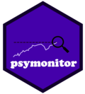

<!-- README.md is generated from README.Rmd. Please edit that file -->

# psymonitor 

[](https://www.tidyverse.org/lifecycle/#experimental)

The *psymonitor* package provides an R implementation of the popular
real-time monitoring strategy proposed by Phillips, Shi and Yu
(2015a,b;PSY), along with a new bootstrap procedure designed to mitigate
the potential impact of heteroskedasticity and to effect family-wise
size control in recursive testing algorithms. This methodology has been
shown effective for bubble and crisis detection (PSY, 2015a,b; Phillips
and Shi, 2017) and is now widely used by academic researchers, central
bank economists, and fiscal regulators.

## Installation

You can install the **development** version from
[Github](https://github.com/itamarcaspi/psymonitor/)

``` r
# install.packages("devtools")
devtools::install_github("itamarcaspi/psymonitor")
```

## Example

## References

  - Phillips, P. C. B., Shi, S., & Yu, J. (2015a). Testing for multiple
    bubbles: Historical episodes of exuberance and collapse in the S\&P
    500. *International Economic Review*, 56(4), 1034–1078.
  - Phillips, P. C. B., Shi, S., & Yu, J. (2015b). Testing for multiple
    bubbles: Limit Theory for Real-Time Detectors. *International
    Economic Review*, 56(4), 1079–1134.
  - Phillips, P. C. B., & Shi, S.(2017). Detecting financial collapse
    and ballooning sovereign risk. Cowles Foundation Discussion Paper
    No. 2110.
